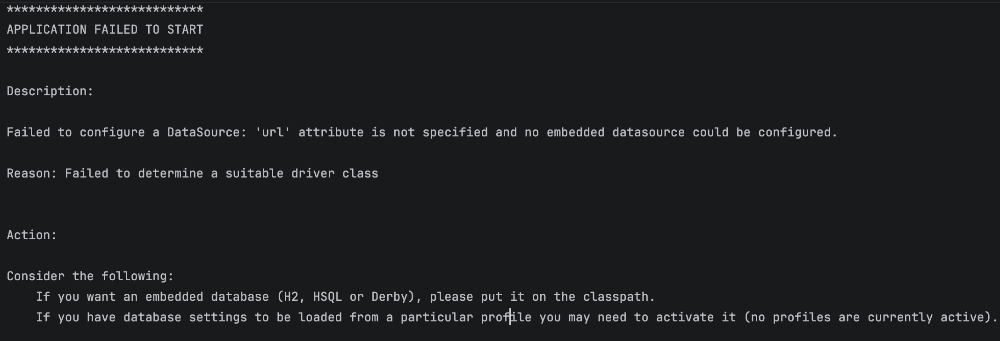
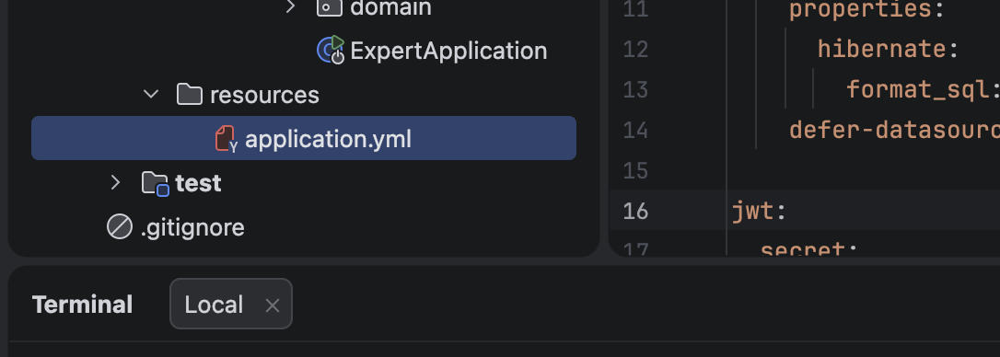
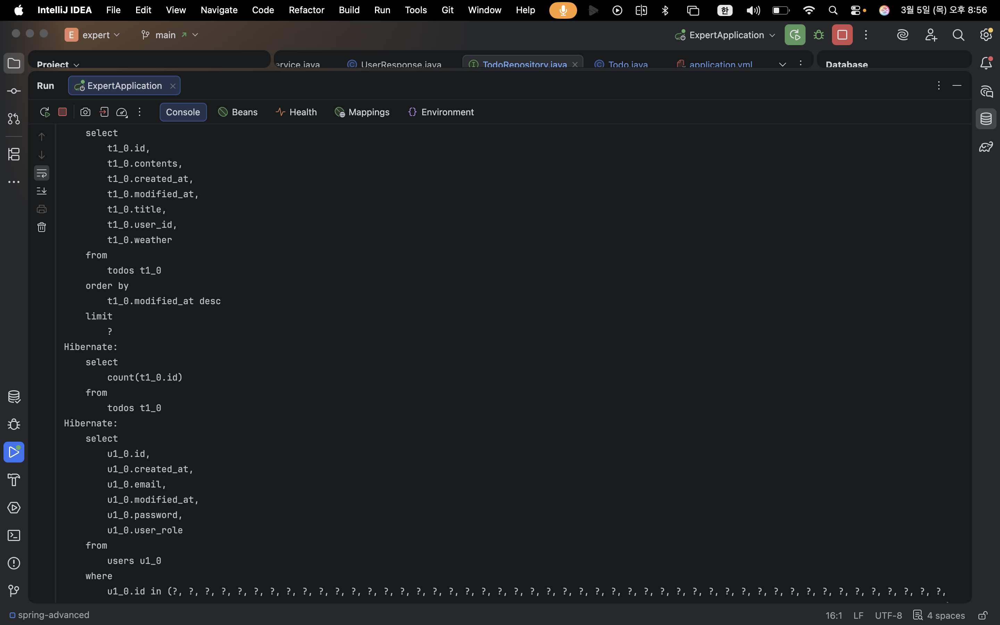
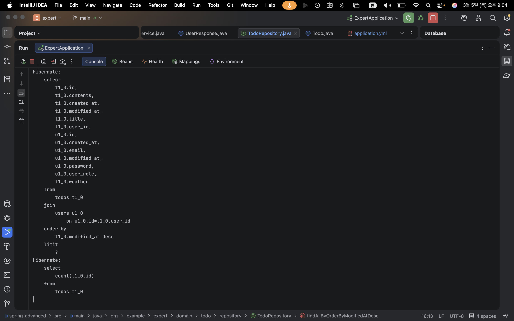

# CH3 심화 Spring 코드 개선 과제

## Lv 0. 프로젝트 세팅 - 에러 분석
1. 깃허브에서 프로젝트 fork 후 clone 하여 실행
2. 에러 확인
    ```
    Error creating bean with name 'filterConfig' defined in file [/Users/parksoyeong/Programming/내일배움캠프/심화 Spring/spring-advanced/build/classes/java/main/org/example/expert/config/FilterConfig.class]: 
    Unsatisfied dependency expressed through constructor parameter 0: Error creating bean with name 'jwtUtil': Injection of autowired dependencies failed
    ```
3. 스프링 빈 생성 하는 과정에서 'filterConfig' 파일에서 jwtUtil 필드의 의존성 주입이 되지 않는 문제 확인
    ```
    Caused by: java.lang.IllegalArgumentException: Could not resolve placeholder 'jwt.secret.key' in value "${jwt.secret.key}"
    ```
4. JWT Secret Key를 설정하는 application.properties나 application.yml 파일 없는 것을 확인하고 파일 생성 후 jwt.secret.key 추가
5. 재실행 결과 Datasource를 찾지 못하는 에러 발생 확인
   
6. datasource와 db 설정 application.yml에 추가하여 해결
7. application.yml 파일 인식이 제대로 되지 않는 문제 확인
    
8. 실행은 되지만 환경 설정에서 gradle wrapper를 찾지 못하고, gradle-wrapper.properties 파일이 없는 문제 확인 후 추가

## Lv 1. ArgumentResolver
AuthUserArgumentResolver를 WebMvcConfigurer을 구현한 Configuration 클래스에서 ArgumentResolver 추가

## Lv 2. 코드 개선
1. AuthService 클래스에서 password encode와 UserRole 추출 전 이메일 존재 여부 확인을 통해 불필요한 로직 실행 방지
2. WeatherClient 클래스에서 불필요한 else 문 제거
3. 유저 비밀번호 변경 요청 시 서비스 단에서 검증하던 비밀번호 패턴을 RequestDto에서 @Pattern, 컨트롤러에서 @Valid 사용하여 검증

## Lv 3. N+1 문제
배치사이즈 설정을 통한 개선 시 SQL


기존 jpql 방식으로 해결하던 N+1 문제를 @EntityGraph 기반 구현으로 변경


## Lv 4. 테스트 코드 연습
1. PasswordEncoderTest 클래스에서 matches 메서드의 파라미터 순서를 바르게 변경
 ``` java
boolean matches = passwordEncoder.matches(rawPassword, encodedPassword);
 ```
2. 실제 ManagerService 로직에서는 manager 목록 조회 시 Todo가 없으면 NPE가 아니라 InvalidRequestException 던지는 것을 확인하고

    ManagerServiceTest에서 메서드 명 변경 및 Manager Not Found -> Todo Not Found로 에러메시지 검증 변경


3. 실제 CommentService 로직에서 comment 등록 중 Todo가 없으면 InvalidRequestException 발생을 확인하고

    CommentServiceTest에서 ServerException -> InvalidRequestException 변경


4. ManagerServiceTest에서 todo의 user가 null인 경우 InvalidRequestException 예외가 발생하도록 하는 테스트를 통과해야 하는데, 
   실제 ManagerService 로직에서는 todo의 user가 null인지 따로 검사하지 않는다.

   nullSafeEquals 메서드를 사용하여 todo user id와 user id가 같으면 통과하고
   같지 않거나, 둘 중 하나라도 null 이면 if 조건문이 true가 되어 InvalidRequestException 발생하지만
   둘 다 null 이면 if 조건문이 false가 되어 통과 해버리는 문제가 있다. 

   따라서 todo의 user id가 null 인 경우도 검사하여 InvalidRequestException을 발생시키도록 수정하였습니다.

## Lv 5. API 로깅
AOP를 활용하여 /admin/* 경로로 들어오는 요청에는
- 요청한 사용자의 ID
- API 요청 시각
- API 요청 URL
- 요청 본문(`RequestBody`)
- 응답 본문(`ResponseBody`)
를 포함한 로그를 남기도록 하였습니다.

커스텀 어노테이션 AdminLogging을 만들어서 aop를 적용할 controller 메서드에 사용해주고

RequestContextHolder에서 받아온 request에서 id와 url을, joinPoint를 사용해 요청 본문을,

메서드 실행 결과에서 응답 본문을 각각 받아와서 로그를 남겨주었습니다.